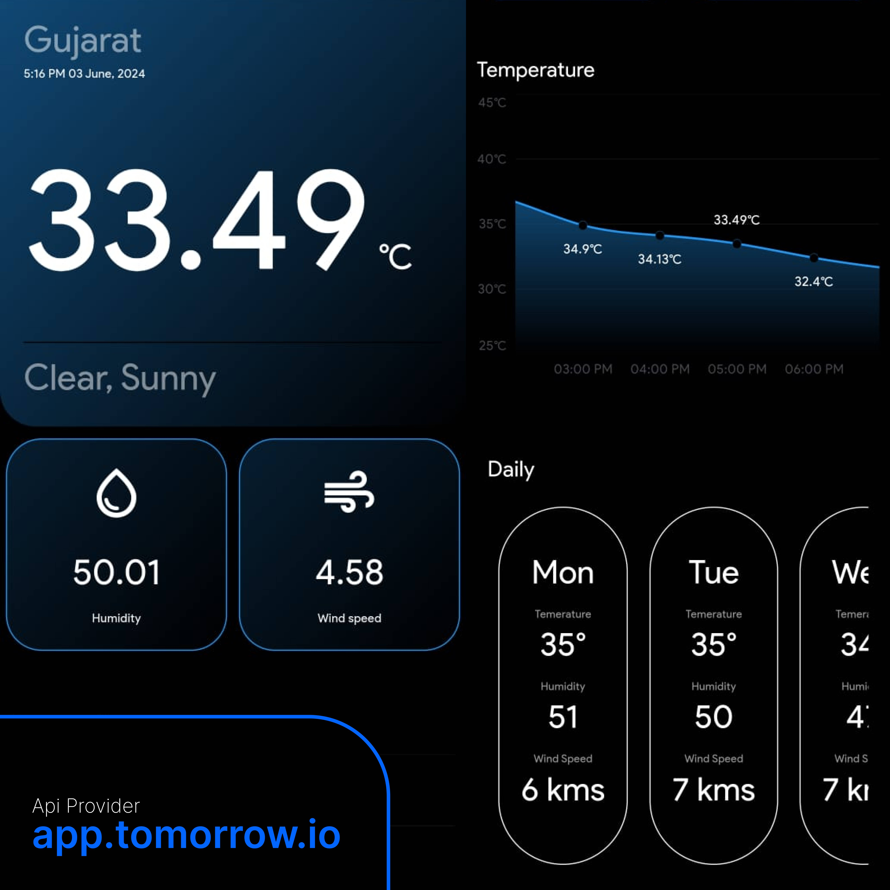

Certainly! Let's create a README file step by step.

### 1. Introduction

Start with a brief introduction to your weather app. Mention its name, its purpose, and its main features.

```markdown
# Awesome Weather App

This is the Awesome Weather App, a Flutter application designed to provide users with accurate weather forecasts in a beautiful and intuitive way. It offers various features to enhance the user experience while keeping them informed about the weather conditions.
```

### 2. Installation Instructions

Provide clear instructions on how to install and run your app from the source code.

## Installation

1. Clone the repository:

```bash
git clone https://github.com/yagnesh0312/weatherapp.git
```

2. Navigate into the project directory:

```bash
cd weatherapp
```

3. Install dependencies:

```bash
flutter pub get
```

4. Run the app:

```bash
flutter run
```

### 3. Features
```markdown
# List the main features of your app to give users an overview of what they can expect.


## Features

- Beautiful UI design
- Accurate weather forecasts
- Customizable themes
- Support for multiple locations
- Hourly and daily forecasts
- Weather alerts for severe conditions
```

### 4. Screenshots

Include screenshots of your app to showcase its UI and features. Make sure to upload these screenshots to your GitHub repository and reference them in your README.


## Screenshots





### 5. Contributing

Encourage others to contribute to your project by providing guidance on how they can do so.


## Contributing

Contributions are welcome! If you'd like to contribute to this project, please follow these steps:

1. Fork the repository
2. Create your feature branch (`git checkout -b feature/AmazingFeature`)
3. Commit your changes (`git commit -m 'Add some amazing feature'`)
4. Push to the branch (`git push origin feature/AmazingFeature`)
5. Open a pull request


### 6. Credits


Acknowledge any individuals or organizations that contributed to the development of your app.


## API Details

The Awesome Weather App uses the following APIs and dependencies to retrieve weather data and location information:

- **Tomorrow.io API**: [Tomorrow.io](https://www.tomorrow.io/)
  - Description: Tomorrow.io provides hyper-local weather forecasts, including minute-by-minute updates, hour-by-hour forecasts, and daily forecasts.
  - Usage: To use Tomorrow.io API, you need to sign up for an API key on their website and include it in your app's configuration.

- **location_plus Dependency**: [location_plus](https://pub.dev/packages/location_plus)
  - Description: The location_plus package is used to retrieve the user's current location in the app.
  - Usage: Add location_plus to your pubspec.yaml file and follow the setup instructions provided in the package documentation to integrate location services into your app.


